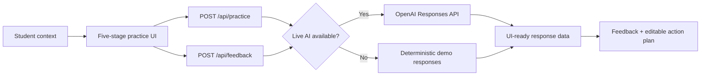

<p align="center">
  
</p>

<p align="center">
  <strong>A bilingual campus communication coach for the rules no one teaches.</strong><br>
  Campus Decoder begins with Chinese international students and is designed to grow to other international and first-generation students.
</p>

<p align="center">
  <code>Track 2 · Equity in Education</code>
  <code>Working Office Hours vertical slice</code>
  <code>Demo works without an API key</code>
</p>

> **Prototype status:** The Office Hours journey is fully implemented. Emailing a Professor and Group Project Conflict are visible previews for the next scenario expansions.

## Why Campus Decoder exists

English proficiency is not the same as cultural fluency.

International students can arrive academically prepared while still lacking access to the unwritten knowledge that culturally familiar students often acquire informally: what office hours are for, how to ask a professor for clarification, when to follow up with a teammate, or which campus resource can help.

Campus Decoder treats that gap as an **educational equity problem**, not a translation problem. It turns hidden institutional context into a guided learning loop:

> **Understand → Practice → Feedback → Act**

The hackathon MVP focuses on a Chinese first-year student preparing for office hours after receiving a disappointing essay grade. The goal is not to hand her a perfect script; it is to help her understand the situation, rehearse her own response, and leave with a next step she can confidently use.

## See the transformation

| Before practice | Campus Decoder adds | Ready for real life |
| --- | --- | --- |
| “Sorry to bother you. I was confused about my grade.” | Office hours are an expected place to discuss feedback; arriving with specific questions signals initiative. | “Thanks for meeting with me. I’d like to understand two comments on my thesis and make a plan for my next essay.” |
| Anxiety about appearing confrontational | A safe AI-professor role-play and supportive, cross-cultural feedback | An editable outline with an opening, questions, evidence to bring, and a closing |

This transformation—not a generic chat window—is the core product proof.

## One journey, five stages

1. **Setup** — Add the course, goal, what happened, coaching language, and optional professor feedback.
2. **Campus context** — Learn what office hours are for and why attending is appropriate.
3. **Practice** — Respond to a simulated professor in English and request a hint only when needed.
4. **Feedback** — Review clarity, tone, specificity, initiative, and campus-context fit.
5. **Action plan** — Edit and copy a meeting outline for the real conversation.

## What makes it different

- **Practice before prescription.** The student formulates a response before seeing an improved alternative.
- **Campus context, not mind-reading.** Guidance separates literal language, likely university context, and a constructive next move without claiming certainty about another person’s intentions.
- **Structured feedback.** The report identifies strengths and the two highest-value improvements across five scenario-specific dimensions.
- **Actionable output.** Every session ends with an editable artifact rather than more information to interpret.
- **English-first, multilingual coaching.** Real-world dialogue stays in English while explanations can be returned in the student’s selected coaching language.

## Run it locally

Requirements: **Node.js 20 or newer**.

The complete demo works without an OpenAI API key:

```bash
npm install
npm run dev
```

Open [http://localhost:3000](http://localhost:3000), choose **Practice Office Hours**, and complete the guided flow.

To use live AI responses instead, create a local environment file:

```bash
cp .env.example .env.local
```

Then add:

```dotenv
OPENAI_API_KEY=your_api_key_here
# Optional; the project provides a default model.
OPENAI_MODEL=your_preferred_model
```

The key is read only by server-side route handlers. Never expose it through a `NEXT_PUBLIC_` variable or client component.

## Demo mode and live mode

| | Demo mode | Live mode |
| --- | --- | --- |
| Trigger | `OPENAI_API_KEY` is missing, or a live request fails | A valid server-side key is available |
| Professor turns | Deterministic scenario responses | OpenAI Responses API |
| Feedback report | Deterministic, schema-shaped report | Structured output validated with Zod |
| Best for | Local development, judging, and repeatable demos | Prompt evaluation and realistic conversation variation |

The fallback is intentional: a missing key should never block someone from testing the full product journey.

## How it works



### Technology

| Layer | Choice |
| --- | --- |
| Application | Next.js 16 App Router, React 19, TypeScript |
| Styling | Tailwind CSS 4 with project design tokens |
| AI | OpenAI JavaScript SDK and Responses API |
| Validation | Zod and strict feedback schemas |
| Motion | Native `IntersectionObserver` scroll reveal with reduced-motion support |
| Persistence | None in the MVP; session state is client-side |

This is a prompt-driven application, not a fine-tuned model. Scenario-specific system prompts, strict output contracts, and product UI shape the experience; they can be revised independently of the base model.

## AI behavior and language contract

| Output | Language |
| --- | --- |
| Simulated professor dialogue | English |
| Suggested student responses and real-world action plan | English |
| Campus-context explanations and coaching feedback | Selected coaching language (`English` or `简体中文`) |

Prompts should remain supportive, specific, and culturally aware. They must:

- treat cultural patterns as context rather than stereotypes;
- preserve multiple valid communication styles and the student’s agency;
- avoid promises about grades, accommodations, or another person’s intentions;
- direct policy, legal, medical, immigration, and mental-health questions to qualified campus resources.

## Project structure

```text
app/
  api/
    feedback/route.ts       # Structured feedback and action plan
    practice/route.ts       # Next simulated professor turn
  practice/office-hours/    # Complete five-stage practice journey
  page.tsx                  # Product story and scenario selection
components/
  practice/                 # Setup, context, practice, feedback, action
  scenario-card.tsx
  scroll-reveal.tsx
  site-header.tsx
lib/
  ai/                       # Client, prompts, schemas, demo fallback
types/
  practice.ts               # Shared request, transcript, and report types
assets/readme/              # Repository presentation assets
```

## Current scope

**Implemented**

- Complete Office Hours setup, context, practice, feedback, and action flow
- Responsive, English-first interface with optional Simplified Chinese coaching
- Deterministic no-key demo and server-side live AI path
- Structured feedback, campus-context cards, hints, progress, and copyable action plan
- Accessible scroll-reveal motion with a reduced-motion fallback

**Not yet implemented**

- Full Emailing a Professor and Group Project Conflict journeys
- Accounts, saved practice history, analytics, or a database
- Voice role-play or institution-specific campus directories
- Automated test coverage
- Production evaluation of live prompts with a real API key

## Commands

```bash
npm run dev      # Start the local development server
npm run lint     # Run ESLint
npm run build    # Create a production build
npm run start    # Serve the production build
```

## Next milestones

1. Run the complete Office Hours journey in a browser at desktop and mobile widths, including loading and error states.
2. Exercise the live OpenAI path with an API key and evaluate professor turns, bilingual coaching, and schema reliability.
3. Add focused tests for validation, demo fallback behavior, and route responses.
4. Convert Emailing a Professor into the next configuration-driven scenario.
5. Capture polished screenshots and a sub-five-minute demo for the hackathon submission.

## Safety and boundaries

Campus Decoder provides educational practice, not official university, immigration, legal, medical, or mental-health advice. Generated guidance may be incomplete or wrong, and users should verify policy-sensitive information with the relevant institution or qualified professional. The product never sends a real-world message without explicit user review.

## License

Campus Decoder is available under the [MIT License](./LICENSE).
