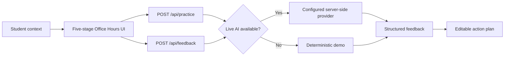

<p align="center">
  
</p>

<p align="center">
  <strong>A campus communication coach for the university rules no one teaches.</strong><br>
  Understand the context, practice the conversation, receive supportive feedback, and leave ready to act.
</p>

<p align="center">
  <a href="https://campus-decoder.zhoulinhua0.workers.dev"><strong>Open the live demo →</strong></a>
</p>

<p align="center">
  <code>Equity in Education</code>
  <code>Next.js 16</code>
  <code>Cloudflare Workers</code>
  <code>Demo works without an API key</code>
</p>

> **Current status:** The complete Office Hours journey is live. Emailing a Professor and Group Project Conflict are visible previews. Production currently uses the clearly labeled deterministic demo path. The Kimi adapter is implemented behind the provider boundary but remains disabled until a server-side API key is configured and evaluated.

## Try the working product

Visit **[campus-decoder.zhoulinhua0.workers.dev](https://campus-decoder.zhoulinhua0.workers.dev)** and:

1. Choose **Practice Office Hours**.
2. Choose your own situation or load the sample, then describe a course, concern, and goal.
3. Review the campus norm behind the situation.
4. Practice your own response to the professor.
5. Finish with transcript-grounded feedback and an editable meeting outline.

The public deployment, Office Hours route, practice API, and feedback API have been verified on Cloudflare Workers.

## The problem

English proficiency is not the same as cultural fluency.

Chinese international students can arrive academically prepared while still lacking access to the university “hidden curriculum”: what Office Hours are for, how to ask a professor for clarification, when to follow up, and how to advocate for themselves without feeling impolite or confrontational.

Campus Decoder treats this as an **educational equity problem**, not a translation problem. Its learning loop is:

> **Understand → Practice → Feedback → Act**

The primary scenario follows a newly arrived first-year student who receives disappointing or unclear essay feedback and does not know what to expect in Office Hours. The product helps the student understand the norm, rehearse their own words, and prepare a concrete next move.

## One journey, five stages

1. **Setup** — Add the course, goal, what happened, concern, coaching language, and optional professor feedback.
2. **Campus context** — Learn what Office Hours are for and what a constructive next step may be.
3. **Practice** — Respond to a simulated professor in English; request a hint only when needed.
4. **Feedback** — Review clarity, tone, specificity, initiative, and campus fit.
5. **Action** — Edit and copy a meeting outline for the real conversation.

## Why it is different

- **Practice before prescription.** The student writes a response before seeing an alternative.
- **Context without mind-reading.** Guidance separates literal language, likely campus context, uncertainty, and a constructive next move.
- **Transcript-grounded feedback.** Original-response comparisons quote only what the student actually submitted.
- **Structured coaching.** The report identifies two strengths and the two highest-value improvements across five dimensions.
- **Action over information.** Every session ends with an editable real-world artifact.
- **English-first, multilingual coaching.** Campus dialogue stays in English while explanations can follow the selected coaching language.

## Honest demo mode

| | Current production | Planned live AI |
| --- | --- | --- |
| Provider | Deterministic demo | Kimi API, called server-side |
| Professor turns | Guided Office Hours sample path | Personalized conversation in English |
| Feedback | Representative coaching grounded in the submitted transcript | Structured bilingual coaching validated with Zod |
| Failure behavior | Remains fully usable without an external service | Falls back safely to the deterministic demo |
| Labeling | Explicitly marked as guided or sample content | Marked as live AI |
| Best use | Repeatable demos, judging, and development | Prompt evaluation and realistic variation |

Demo ratings never pretend to be personalized AI analysis, and demo feedback never invents student quotations.

## How it works



| Layer | Choice |
| --- | --- |
| Application | Next.js 16 App Router, React 19, TypeScript |
| Styling | Tailwind CSS 4 and project design tokens |
| AI | Deterministic demo today; Kimi selected for the future live path |
| Validation | Zod request and feedback contracts |
| Testing | Playwright mobile Chromium journey |
| Hosting | OpenNext, Wrangler, and Cloudflare Workers |
| Persistence | None in the MVP; session state is client-side |

## Run locally

Requirements: **Node.js 20 or newer**.

```bash
npm install
npm run dev
```

Open [http://localhost:3000](http://localhost:3000). The full demo works without external services or an API key.

## Optional Kimi live mode

The server-side provider boundary exposes two implementations:

```text
DemoProvider       # Default, deterministic, no external service
KimiProvider       # Optional live mode with validated structured output
```

KimiProvider uses Kimi's OpenAI-compatible Chat Completions API and JSON Schema output, then validates every feedback response with the existing Zod contract.

Enable it only after creating a Kimi project key and evaluating the model:

```dotenv
AI_PROVIDER=kimi
MOONSHOT_API_KEY=your_server_side_key
KIMI_MODEL=kimi-k3
```

The `/api/practice` and `/api/feedback` contracts do not change between modes. Missing configuration, invalid structured output, empty responses, timeouts, and provider errors fall back to `DemoProvider`. API keys remain server-only and must never use a `NEXT_PUBLIC_*` variable.

## Verify changes

```bash
npm run lint
npm run build
npm run test:e2e
```

Install the Playwright browser once before the end-to-end test:

```bash
npx playwright install chromium
```

The E2E test completes the mobile Office Hours journey from the landing page through the sample action plan.

## Deploy to Cloudflare Workers

The production site is:

**[https://campus-decoder.zhoulinhua0.workers.dev](https://campus-decoder.zhoulinhua0.workers.dev)**

Preview the OpenNext build in Cloudflare's local `workerd` runtime:

```bash
npm run preview:cloudflare
```

Deploy from an authenticated local environment:

```bash
npm run deploy:cloudflare
```

The manual workflow at `.github/workflows/deploy-cloudflare.yml` deploys `main` using these GitHub repository secrets:

- `CLOUDFLARE_API_TOKEN`
- `CLOUDFLARE_ACCOUNT_ID`

Before enabling Kimi, store `MOONSHOT_API_KEY` as a Cloudflare Worker secret and set `AI_PROVIDER=kimi` as a runtime variable. The deploy command preserves existing runtime secrets. GitHub Pages is not supported because the application requires server-side Route Handlers.

## Project map

```text
app/
  api/
    feedback/route.ts       # Structured feedback and action plan
    practice/route.ts       # Next simulated professor turn
  practice/office-hours/    # Complete five-stage journey
  page.tsx                  # Product story and scenario selection
components/
  practice/                 # Setup, context, practice, feedback, action
lib/
  ai/                       # Providers, prompts, schemas, demo fallback
tests/e2e/                  # Office Hours browser journey
types/
  practice.ts               # Shared UI and API contracts
wrangler.jsonc              # Cloudflare Worker configuration
open-next.config.ts         # OpenNext adapter configuration
```

## Current limits

- Kimi live mode is implemented but has not been evaluated with a funded API key or enabled in production.
- Campus Context is currently general guidance rather than AI-personalized interpretation.
- Emailing a Professor and Group Project Conflict are not implemented flows.
- There is no authentication, saved history, database, analytics, or voice role-play.
- Desktop, tablet, keyboard, long-content, and reduced-motion QA remain to be completed.

## Next

1. Validate the Office Hours narrative with Chinese and other international students new to U.S. university culture.
2. Test Kimi professor turns, bilingual coaching, schema reliability, latency, and safe fallback behavior before enabling the production secret.
3. Personalize Campus Context using the student's situation and optional professor feedback.
4. Complete accessibility and cross-device QA, then capture screenshots and record the hackathon demo.
5. Implement Emailing a Professor only after the primary journey is validated.

## Safety

Campus Decoder provides educational practice, not official university, immigration, legal, medical, or mental-health advice. Users should verify policy-sensitive guidance with the relevant institution or qualified professional. The product never sends a real-world message without explicit review.

## License

Campus Decoder is available under the [MIT License](./LICENSE).
