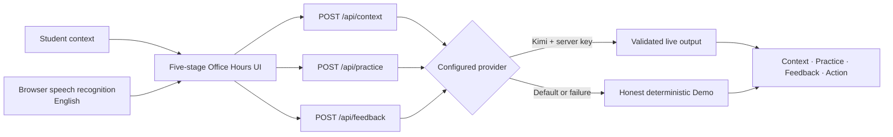

<p align="center">
  
</p>

<p align="center">
  <strong>A campus communication coach for the university rules no one teaches.</strong><br>
  Understand the context, practice the conversation, receive supportive feedback, and leave ready to act.
</p>

<p align="center">
  <a href="https://campus-decoder.zhoulinhua0.workers.dev"><strong>Try the live Office Hours journey →</strong></a>
</p>

<p align="center">
  <code>Equity in Education</code>
  <code>Next.js 16</code>
  <code>Cloudflare Workers</code>
  <code>Works without an API key</code>
</p>

> **Live now:** one complete, deployed Office Hours journey with grounded campus-context coaching, typed or English voice input, structured feedback, and an editable meeting outline. Production intentionally uses the clearly labeled deterministic Demo provider; Kimi is implemented locally but not enabled.

## Try the product

Open **[Campus Decoder](https://campus-decoder.zhoulinhua0.workers.dev)**, choose **Practice Office Hours**, and complete one conversation:

1. Choose **Use my situation** for an empty form or **Try the sample** for the judge demo.
2. Review the grounded Context guidance, then practice your own English response by typing or speaking.
3. Finish with transcript-grounded feedback and an editable meeting outline.

The professor is presented honestly as **Practice Professor**, paired with the course the student entered. The opening turn is requested with the full situation context, while avoiding claims that the student has already shared private concerns aloud.

## Verified demo baseline

| Proof | Current result |
| --- | --- |
| Production | Homepage, Office Hours journey, and grounded Context API verified on Cloudflare Workers |
| Automated regression | **32 passing checks**, 12 intentional project-specific skips, 0 failures |
| Responsive coverage | 375px portrait, mobile landscape, 768px tablet, and 1440px desktop |
| Browser engines | Chromium plus desktop WebKit as a Safari-engine approximation |
| Accessibility | Five-stage axe WCAG 2 A/AA scan, skip navigation, keyboard focus, 44px targets, and reduced-motion checks |
| Resilience | Long unbroken content plus English speech mocks, permission denial, missing device, restart, and dictation length limit |

## Why Campus Decoder exists

English proficiency is not the same as cultural or institutional fluency.

Chinese international students can arrive academically prepared while still lacking access to the university “hidden curriculum”: what Office Hours are for, how to ask a professor for clarification, when to follow up, and how to advocate for themselves without feeling impolite or confrontational.

Campus Decoder treats that gap as an **educational equity problem**, not merely a translation problem. The product loop is:

> **Understand → Practice → Feedback → Act**

The focused MVP follows a newly arrived student who receives disappointing or unclear feedback and is unsure how to approach Office Hours. Instead of supplying a perfect script immediately, Campus Decoder explains the norm, lets the student rehearse their own words, and turns the session into a concrete next action.

## One journey, five stages

| Stage | Student outcome |
| --- | --- |
| **1 · Setup** | Describe a genuine situation or load the clearly separated sample. |
| **2 · Context** | Decode the submitted situation into literal source, campus context, uncertainty, and one constructive next move. |
| **3 · Practice** | Write or dictate responses to a simulated professor in natural English. |
| **4 · Feedback** | Review clarity, tone, specificity, initiative, campus fit, and two high-value improvements. |
| **5 · Action** | Edit and copy a meeting outline for the real conversation. |

## What makes it different

- **Cultural context, not mind-reading.** Coaching distinguishes literal source text, likely campus context, uncertainty, and a constructive next move.
- **Practice before prescription.** The student writes their own response before seeing an editable alternative.
- **Grounded feedback.** Demo comparisons quote only language the student actually submitted.
- **A neutral practice identity.** The role-play no longer invents “Professor Chen” or assumes every situation concerns an essay.
- **One focused English experience.** The interface, coaching, role-play, feedback, and action plan stay in English while addressing cross-cultural campus communication.
- **Action over information.** Every completed session ends with a usable meeting outline rather than generic reassurance.

## Honest Demo and optional live AI

| Capability | Production Demo | Kimi live mode |
| --- | --- | --- |
| Availability | Default; no API key required | Optional; server-side key required |
| Context decode | Deterministic guidance grounded in the submitted setup | Structured English decode validated with Zod |
| Opening turn | Neutral, deterministic opening | Context-aware opening generated from the setup |
| Follow-up turns | Clearly labeled guided sample path | Dynamic English professor dialogue |
| Feedback | Representative coaching grounded in submitted text | Structured English coaching validated with Zod |
| English dictation | Browser speech recognition | Browser speech recognition |
| Failure behavior | Remains usable | Falls back safely to Demo for context, practice, and feedback |

Demo ratings never pretend to be personalized AI analysis.

## How it works



| Layer | Implementation |
| --- | --- |
| Application | Next.js 16 App Router, React 19, TypeScript |
| Interface | Tailwind CSS 4 with the project’s off-white, deep-teal, and warm-amber system |
| AI boundary | `DemoProvider` and optional `KimiProvider` behind one server-side contract |
| Validation | Zod request, context, and structured-feedback schemas |
| Voice | Browser Web Speech API with explicit `en-US` / `zh-CN` switching |
| Testing | Playwright plus axe-core across mobile, tablet, desktop Chromium, and desktop WebKit projects |
| Hosting | OpenNext, Wrangler, and Cloudflare Workers |
| Persistence | None by design for the MVP; session state is ephemeral |

## Run locally

Requirements: **Node.js 20 or newer**.

```bash
npm install
npm run dev
```

Open [http://localhost:3000](http://localhost:3000). The complete deterministic journey works without an external AI service or API key.

## Optional Kimi live mode

The app exposes one internal provider contract with two implementations:

```text
DemoProvider   # Default, deterministic, no external service
KimiProvider   # Optional live context, dialogue, and feedback
```

Kimi uses its OpenAI-compatible Chat Completions API. Structured feedback is requested with JSON Schema and validated again with the existing Zod contract.

After funding and evaluating a Kimi project key, configure these **server-only** values:

```dotenv
AI_PROVIDER=kimi
MOONSHOT_API_KEY=your_server_side_key
KIMI_CONTEXT_MODEL=kimi-k2.6
KIMI_PRACTICE_MODEL=kimi-k2.6
KIMI_FEEDBACK_MODEL=kimi-k2.6
```

`KIMI_MODEL` remains available as an optional global override. The evaluated default uses Kimi K2.6 with thinking disabled for all three operations. Context and Feedback allow up to 45 seconds per request and retry structured, truncated, empty, or ungrounded output once; Practice uses a 20-second request timeout. Live retries and fallbacks emit privacy-safe operation, model, reason, and latency metadata without student content, transcripts, source feedback, drafts, or credentials.

The three route contracts remain provider-neutral:

- `POST /api/context` — turn the validated setup into bounded, grounded campus guidance.
- `POST /api/practice` — generate the opening or next professor turn.
- `POST /api/feedback` — generate the completed-session report and action plan.

Never expose the API key through a `NEXT_PUBLIC_*` variable. Invalid, empty, truncated, timed-out, or unavailable live practice and feedback output falls back safely to the Demo provider.

## Verify changes

```bash
npm run lint
npm run build
npm run test:e2e
npm run test:kimi # opt-in funded live evaluation; never runs in CI
```

Install the Playwright browser once if needed:

```bash
npx playwright install chromium webkit
```

The current suite reports **32 passing checks** across five Playwright projects, with 12 intentional project-specific skips. Coverage includes:

- personal versus sample setup;
- grounded English context guidance, including the no-feedback path;
- context request validation and invalid structured-output rejection;
- context-aware opening requests with an empty transcript;
- deterministic Demo openings and follow-ups;
- `Enter`, `Shift` + `Enter`, and IME-safe submission;
- mocked English speech recognition;
- microphone denial, missing-device, stop/restart, and long-dictation handling;
- 375px portrait, mobile landscape, tablet, and desktop overflow and target-size checks;
- keyboard focus, skip navigation, five-stage WCAG checks, reduced motion, and long unbroken content;
- desktop WebKit layout coverage as an automated Safari-engine approximation;
- Kimi request shapes, JSON Schema feedback, provider selection, and invalid-output rejection.

## Deploy to Cloudflare Workers

Production: **[https://campus-decoder.zhoulinhua0.workers.dev](https://campus-decoder.zhoulinhua0.workers.dev)**

The current production release includes the grounded Context flow and the responsive/accessibility QA fixes.

Preview the OpenNext build in Cloudflare’s local `workerd` runtime:

```bash
npm run preview:cloudflare
```

Deploy from an authenticated maintainer environment:

```bash
npm run deploy:cloudflare
```

The manual workflow at `.github/workflows/deploy-cloudflare.yml` uses the repository secrets `CLOUDFLARE_API_TOKEN` and `CLOUDFLARE_ACCOUNT_ID`. Before enabling Kimi, add `MOONSHOT_API_KEY` as a Cloudflare Worker secret and set `AI_PROVIDER=kimi` as a runtime variable. GitHub Pages is not supported because this application requires server-side Route Handlers.

## Project map

```text
app/
  api/
    context/route.ts        # Grounded campus-context decode
    practice/route.ts       # Opening and follow-up professor turns
    feedback/route.ts       # Structured feedback and action plan
  practice/office-hours/    # Complete five-stage journey
components/practice/        # Setup, context, practice, feedback, and action UI
lib/ai/
  providers.ts              # Provider contract, Demo fallback, Kimi adapter
  prompts.ts                # Context, role-play, and feedback prompts
  schemas.ts                # Request and structured-output validation
  mock.ts                   # Deterministic Demo output
tests/e2e/
  office-hours.spec.ts      # Journey, keyboard, and English speech
  providers.spec.ts         # Contracts, grounding, fallback behavior
  qa.spec.ts                # Responsive, accessibility, long-content QA
types/practice.ts           # Shared UI and API contracts
wrangler.jsonc              # Cloudflare Worker configuration
open-next.config.ts         # OpenNext adapter configuration
```

## Current limits

- Production still uses deterministic Demo mode; the funded Kimi boundary has been evaluated locally but is not enabled in production.
- The local funded gate covers English Context and Feedback plus multi-turn English Practice. The sample is intentionally small and does not replace repeated hands-on product evaluation.
- Emailing a Professor and Group Project Conflict are preview cards, not implemented journeys.
- Voice input depends on browser Web Speech API support, microphone permission, and the browser’s speech service. Typed input remains available.
- Automated voice tests use a browser mock; real Chrome and Safari microphone behavior still needs hands-on QA on the devices planned for the demo.
- Desktop WebKit automation exercises Safari’s browser engine, but it does not replace testing the actual Safari app, speech service, permissions, and microphone hardware.
- The MVP has no authentication, database, saved history, analytics, or progress tracking.
- Privacy-safe retry and fallback events are implemented, but there is no production Kimi traffic to observe until live mode is deliberately enabled.

## Next priorities

1. Repeat the complete local Kimi journey hands-on and review English coaching quality and structured retry frequency.
2. Test the Office Hours journey with Chinese and other international students new to U.S. university culture.
3. Verify English dictation on the real Chrome and Safari devices planned for the demo.
4. Decide whether the measured latency and retry rate are acceptable before configuring Cloudflare secrets or enabling production Kimi.
5. Perform final hands-on device QA, then capture screenshots and record the hackathon demo.
6. Expand to Emailing a Professor only after the Office Hours journey is validated.

## Safety

Campus Decoder provides educational practice, not official university, immigration, legal, medical, or mental-health advice. Users should verify policy-sensitive guidance with the relevant institution or a qualified professional. The product never sends a real-world message without explicit review.

## License

Campus Decoder is available under the [MIT License](./LICENSE).
