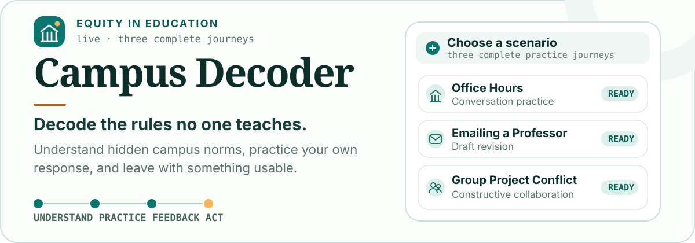
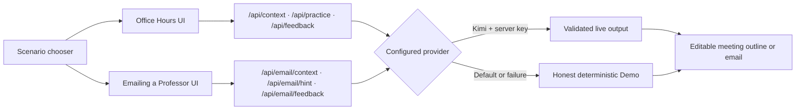

<p align="center">
  
</p>

<p align="center">
  <strong>A campus communication coach for the university rules no one teaches.</strong><br>
  Choose a real moment, understand the context, practice your response, receive supportive feedback, and leave ready to act.
</p>

<p align="center">
  <a href="https://campus-decoder.zhoulinhua0.workers.dev"><strong>Access the Live Website here</strong></a>
</p>

<p align="center">
  <code>Equity in Education</code>
  <code>Next.js 16</code>
  <code>Cloudflare Workers</code>
  <code>Works without an API key</code>
</p>

> **Current release:** two complete five-stage journeys—**Office Hours** and **Emailing a Professor**—behind a neutral scenario chooser. **Group Project Conflict** remains an honest preview. The same release is deployed to Cloudflare Workers and works with either live Kimi coaching or the safe Demo fallback.

## Choose a campus moment

Run the current repository, open **[localhost:3000/practice](http://localhost:3000/practice)**, and choose one scenario:

| Scenario | What the student practices | Repository status |
| --- | --- | --- |
| **Office Hours** | Discuss feedback, ask focused questions, and identify a next step without sounding confrontational. | Complete |
| **Emailing a Professor** | Revise an overly formal, vague, or apologetic draft into a clear email with an explicit request. | Complete |
| **Group Project Conflict** | Follow up on missed work, propose task division, and handle disagreement constructively. | Preview only |

The chooser gives all three scenarios the same visual hierarchy. Unfinished scenarios are never presented as usable flows.

## Verified baseline

| Proof | Current result |
| --- | --- |
| Complete journeys | Office Hours and Emailing a Professor, each using Setup → Context → Practice → Feedback → Action |
| Kimi email smoke checks | Local and production Email Context, Hint, and Feedback routes returned HTTP 200 with `mode: live` and complete structured fields |
| Automated regression | **39 passing checks**, 16 intentional project-specific skips, 0 failures |
| Responsive coverage | 375px portrait, mobile landscape, 768px tablet, and 1440px desktop |
| Browser engines | Chromium plus desktop WebKit as a Safari-engine approximation |
| Accessibility | Five-stage axe WCAG 2 A/AA scans, skip navigation, keyboard focus, 44px targets, and reduced-motion checks |
| Demo resilience | Deterministic no-key provider plus safe route-level fallback for invalid, timed-out, or unavailable live output |

## Why Campus Decoder exists

English proficiency is not the same as cultural or institutional fluency.

Chinese international students can arrive academically prepared while still lacking access to the university “hidden curriculum”: what Office Hours are for, how to ask a professor for clarification, how direct an email request should be, when to follow up, and how to advocate for themselves without feeling impolite or confrontational.

Campus Decoder treats that gap as an **educational equity problem**, not merely a translation problem. The founder recently completed the university application process and brings direct familiarity with the Chinese international-student experience.

The product loop is:

> **Understand → Practice → Feedback → Act**

The student sees the campus norm, tries their own wording, receives specific feedback grounded in what they submitted, and leaves with an editable artifact instead of generic reassurance.

## Two journeys, one learning loop

| Stage | Office Hours | Emailing a Professor |
| --- | --- | --- |
| **1 · Setup** | Course, goal, situation, concern, and optional professor feedback. | Course, recipient, purpose, situation, concern, and existing draft. |
| **2 · Context** | Separate the literal source, campus context, uncertainty, and one constructive next move. | Explain what the email needs to communicate without predicting the professor’s response. |
| **3 · Practice** | Write or dictate responses to a simulated Practice Professor. | Revise the draft personally while AI provides one focused hint and an optional sentence starter. |
| **4 · Feedback** | Review clarity, tone, specificity, initiative, campus fit, and two high-value improvements. | Review tone, clarity, specificity, request clarity, and two grounded improvements. |
| **5 · Action** | Edit and copy a meeting outline. | Edit and copy the final subject and email body; nothing is sent automatically. |

In live Kimi mode, the final email is an AI-edited version of the student’s own revision. It must preserve submitted facts, purpose, and placeholders and may not invent dates, policies, permissions, or prior agreements. In Demo mode, the final email remains the student’s revision rather than pretending fixed coaching produced a personalized rewrite.

## What makes it different

- **Cultural context, not mind-reading.** Coaching distinguishes literal source text, likely campus context, uncertainty, and a constructive next move.
- **Practice before prescription.** The student tries their own wording before seeing focused alternatives or an AI-edited final artifact.
- **Grounded feedback.** Quoted comparisons must be verbatim excerpts from the student’s submitted response or revised draft.
- **Cultural awareness without stereotypes.** The product explains common institutional patterns while preserving multiple valid communication styles and the student’s agency.
- **One focused English experience.** The interface, coaching, simulated dialogue, feedback, and action artifacts remain English-only.
- **Action over information.** Every completed session ends with something editable and usable: a meeting outline or professor email.

## Honest Demo and optional live AI

| Capability | Demo fallback | Kimi live mode |
| --- | --- | --- |
| Availability | Default; no API key required | Server-side key required |
| Context | Deterministic guidance grounded in submitted setup | Structured guidance validated with Zod |
| Office Hours Practice | Clearly labeled guided professor path | Dynamic context-aware professor dialogue |
| Email Practice | Fixed-rule hint that leaves the writing to the student | One structured, focused revision hint |
| Feedback | Representative ratings and coaching; quotes remain grounded | Structured coaching with verbatim excerpt validation |
| Action | Student-grounded meeting outline or unchanged revised email | Live action plan or AI-edited final email |
| Failure behavior | Remains usable | Falls back safely and visibly to Demo |

Demo output never claims that fixed ratings or coaching are personalized AI analysis.

## How it works



| Layer | Implementation |
| --- | --- |
| Application | Next.js 16 App Router, React 19, TypeScript |
| Interface | Tailwind CSS 4 with the project’s off-white, deep-teal, and warm-amber system |
| AI boundary | `DemoProvider` and optional `KimiProvider` behind one server-side contract |
| Validation | Zod request and structured-output contracts for both journeys |
| Voice | English browser speech recognition in Office Hours; typed input always remains available |
| Testing | Playwright plus axe-core across mobile, tablet, desktop Chromium, and desktop WebKit projects |
| Hosting | OpenNext, Wrangler, and Cloudflare Workers |
| Persistence | None by design for the MVP; session state is ephemeral |

## Run locally

Requirements: **Node.js 20 or newer**.

```bash
npm install
npm run dev
```

Open **[http://localhost:3000/practice](http://localhost:3000/practice)**. Both complete journeys work through the deterministic Demo provider without an external AI service or API key.

## Optional Kimi live mode

The app exposes one internal provider contract with two implementations:

```text
DemoProvider   # Default, deterministic, no external service
KimiProvider   # Optional live context, practice, and feedback
```

Kimi uses its OpenAI-compatible Chat Completions API. Structured output is requested with JSON Schema and validated again with Zod before the UI receives it.

Configure these **server-only** values in `.env.local`:

```dotenv
AI_PROVIDER=kimi
MOONSHOT_API_KEY=your_server_side_key
KIMI_CONTEXT_MODEL=kimi-k2.6
KIMI_PRACTICE_MODEL=kimi-k2.6
KIMI_FEEDBACK_MODEL=kimi-k2.6
```

Restart `npm run dev` after changing environment variables. `KIMI_MODEL` remains available as an optional global override. Never expose the API key through a `NEXT_PUBLIC_*` variable.

The provider-neutral route contracts are:

- `POST /api/context` — grounded Office Hours campus guidance.
- `POST /api/practice` — Office Hours opening or next professor turn.
- `POST /api/feedback` — Office Hours report and meeting outline.
- `POST /api/email/context` — grounded professor-email context guidance.
- `POST /api/email/hint` — one focused hint without a complete replacement draft.
- `POST /api/email/feedback` — grounded email feedback and an editable final email.

Context and Feedback allow up to 45 seconds per request; Practice and Hint use a 20-second timeout. Structured, empty, truncated, schema-invalid, or ungrounded output is retried where appropriate and then falls back safely. Privacy-safe telemetry records operation, model, reason, safe schema paths, and elapsed time without student inputs, transcripts, drafts, credentials, or raw errors.

## Verify changes

```bash
npm run lint
npm run build
AI_PROVIDER=demo npm run test:e2e
npm run test:kimi # opt-in funded live evaluation; never runs in CI
```

Install Playwright browsers once if needed:

```bash
npx playwright install chromium webkit
```

The current suite reports **39 passing checks** across five Playwright projects, with 16 intentional project-specific skips. Coverage includes:

- neutral homepage entry points and three equal-size scenario cards;
- complete Office Hours and Emailing a Professor journeys;
- required-field and unchanged-draft validation;
- grounded Context, Feedback, and email excerpts;
- Demo/Kimi provider selection, JSON Schema requests, retries, and fallback behavior;
- browser speech mocks, microphone denial, missing-device, restart, and dictation limits;
- 375px portrait, mobile landscape, tablet, and desktop overflow and target-size checks;
- keyboard focus, skip navigation, five-stage axe scans, reduced motion, and long unbroken content;
- desktop WebKit layout coverage as an automated Safari-engine approximation.

## Deploy to Cloudflare Workers

Current production demo: **[campus-decoder.zhoulinhua0.workers.dev](https://campus-decoder.zhoulinhua0.workers.dev)**

The deployed release includes the neutral scenario chooser plus the complete Office Hours and Emailing a Professor journeys. Production smoke checks confirm that all four public pages load and that Email Context, Hint, and Feedback return validated live Kimi output.

```bash
npm run preview:cloudflare
npm run deploy:cloudflare
```

The manual workflow at `.github/workflows/deploy-cloudflare.yml` uses the repository secrets `CLOUDFLARE_API_TOKEN` and `CLOUDFLARE_ACCOUNT_ID`. Add `MOONSHOT_API_KEY` as a Cloudflare Worker secret and set `AI_PROVIDER=kimi` as a runtime variable. GitHub Pages is not supported because the product requires server-side Route Handlers.

## Project map

```text
app/
  api/
    context/route.ts              # Office Hours grounded context
    practice/route.ts             # Office Hours professor turns
    feedback/route.ts             # Office Hours feedback and action plan
    email/
      context/route.ts            # Email campus-context guidance
      hint/route.ts               # Focused draft hint
      feedback/route.ts           # Email feedback and final editable draft
  practice/
    page.tsx                      # Neutral three-scenario chooser
    office-hours/                 # Complete five-stage Office Hours journey
    email-professor/              # Complete five-stage email journey
components/practice/              # Shared and journey-specific stage interfaces
lib/ai/
  providers.ts                    # Demo/Kimi contract and fallback
  prompts.ts                      # Office Hours prompts
  email-prompts.ts                # Email Context, Hint, and Feedback prompts
  schemas.ts                      # Office Hours validation
  email-schemas.ts                # Email validation
  mock.ts                         # Office Hours deterministic Demo output
  email-mock.ts                   # Email deterministic Demo output
tests/e2e/
  scenario-selection.spec.ts      # Neutral entry and equal card hierarchy
  office-hours.spec.ts            # Office Hours journey and speech behavior
  email-professor.spec.ts         # Complete email journey
  providers.spec.ts               # Contracts, grounding, retry, fallback
  qa.spec.ts                      # Responsive and accessibility QA
types/
  practice.ts                     # Office Hours contracts
  email-practice.ts               # Email contracts
```

## Current limits

- Group Project Conflict is a visible preview, not an implemented journey.
- Live email Context, Hint, and Feedback passed both local and production runtime smoke checks, but repeated hands-on quality and latency evaluation is still needed.
- Voice input is available only in Office Hours and depends on browser speech-recognition support, microphone permission, and the browser’s speech service. Typed input remains universal.
- Desktop WebKit automation approximates Safari’s engine; real Safari permissions, speech services, and microphone hardware still require hands-on verification.
- The MVP has no authentication, database, saved history, analytics, or progress tracking.
- Guidance is educational and does not replace official university policy or qualified legal, immigration, medical, or mental-health advice.

## Next priorities

1. Run hands-on Emailing a Professor QA in live Kimi mode and review final-email factual preservation, tone, latency, and fallback behavior.
2. Validate both complete journeys with Chinese and other international students new to U.S. university culture.
3. Test English dictation on the real Chrome and Safari devices planned for the demo.
4. Capture updated production screenshots and record the under-five-minute demo video.
6. Build Group Project Conflict only after the two completed journeys are stable.

## Safety

Campus Decoder provides educational practice, not official university, immigration, legal, medical, or mental-health advice. Users should verify policy-sensitive guidance with the relevant institution or a qualified professional. The product never sends a real-world message without explicit review.

## License

Campus Decoder is available under the [MIT License](./LICENSE).
